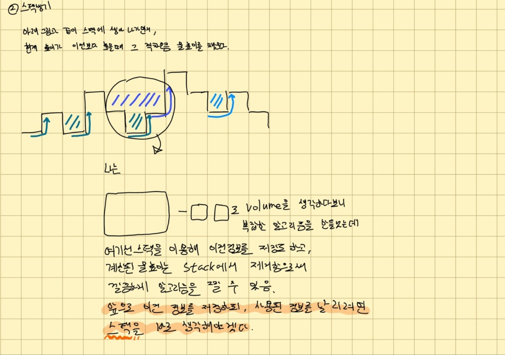

## 빗물 트래핑

높이를 입력받아 비 온 후 얼마나 많은 물이 쌓일 수 있는지 계산하라.

### solution 1 : 투포인트를 최대로 이동


```python
def solution(height: list):
    """
    의미는 알겠으나, 이 알고리즘이 예외가 없는 알고리즘인지 점검을 끊임없이 하느라 시간이 소요됨.
    그리고 두 포인트에 조건을 걸어, 최대 값을 가진 인덱스까지 가도록 하는건 좋았다.
    하지만 내가 실제로 알고리즘 문제를 풀때에는 탐색을 통해, 최대값을 가진 인덱스를 미리 알아보고 그 인덱스까지 실행했을 듯. 좀 더 직관적.
    """
    if len(height) < 3:
        return 0

    volume = 0
    left_point, right_point = 0, (len(height)-1)
    left_max, right_max = 0, 0
    while left_point != right_point:

        if height[left_point] <= height[right_point]:
            left_max = max(left_max, height[left_point])

            volume += left_max - height[left_point]
            left_point += 1
        else:
            right_max = max(right_max, height[right_point])

            volume += right_max - height[right_point]
            right_point -= 1

    return volume
```


### solution2 : 스택 쌓기 



```python
def solution(heights: list):
    """
    나의 풀이는 채워진 물은 height가 높아진 것이라고 가정하여, 다시 pop한 height가 물로 인해 채워진 만큼 다시 push 하는 반면
    책 풀이에서는 인덱스로 접근하여, distance를 구한다.
    solution1 보다는 직관적이여서 예외를 생각하는게 단순하였다.
    """
    volume = 0
    stack, max_height = [], 0
    for height in heights:

        pop_heights = []
        standard_height = min(max_height, height)
        while len(stack) and standard_height > stack[-1]:
            pop_height = stack.pop(-1)

            volume += (standard_height - pop_height)
            pop_heights.append(pop_height + (standard_height-pop_height))
        stack += reversed(pop_heights)
        max_height = max(max_height, height)
        stack.append(height)

    return volume
```