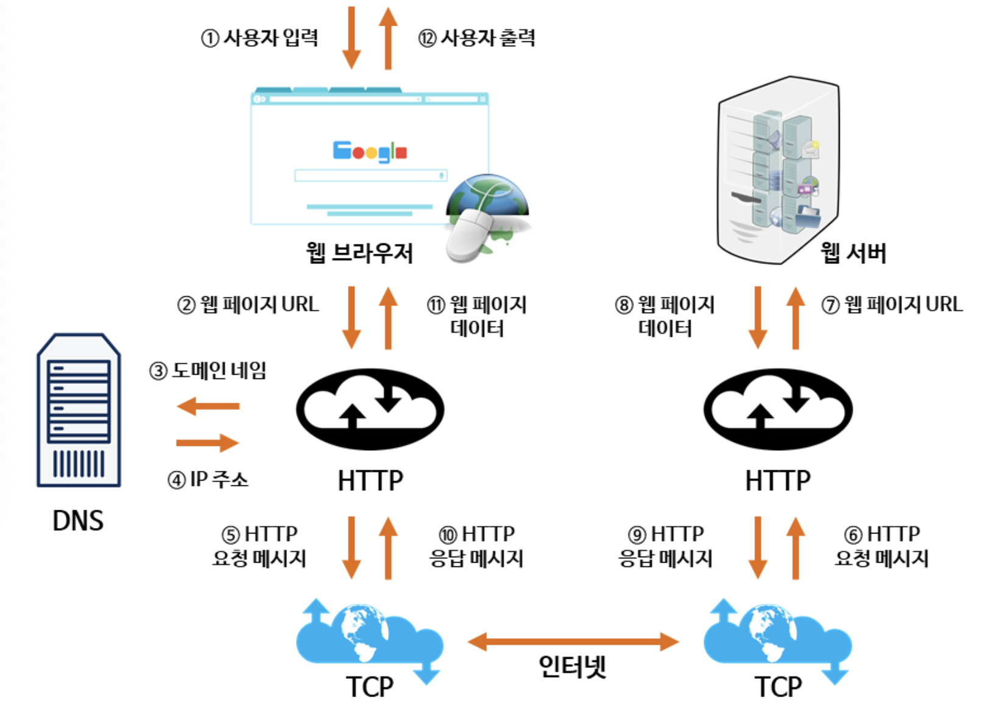

# 네트워크

## OSI 계층

7. Application layer
   - 사용자와 가장 가까운 계층으로, 응용 프로그램을 통해 사용자와 직접적으로 상호작용함.
   - 데이터 단위 : message, 대표 프로토콜 : HTTP, SMTP,FTP, SIP

6. presentation layer
   - 응용 계층에서 사용되는 데이터를 해석하는 계층. (데이터의 암호화 & 복호화)
   - 응용프로그램 ↔ 네트워트 간 정해진 형식대로 데이터 변환
   - 데이터 단위 : message, 대표 프로토콜: ASCII, MPEG

5. session layer
   - 데이터 교환의 연결을 담당하는 계층. 연결이 손실되는 경우, 연결 복구를 시도.
   - 오랜시간 연결이 되지 않으면, 세션계층의 프로토콜이 연결을 닫고 다시 연결 재개
   - 데이터를 상대방이 보내고 있을때 동시에 보낼것인지에 대한 전이중(동시에 보냄, 예:전화기) / 반이중(한쪽만 보냄, 무전기) 통신을 결정함
   - 데이터 단위 : message, 대표 프로토콜: NetBIOS, TLS

4. transport layer
   - 상위 계층의 메시지를 하위 계층으로 전송
   - 메시지의 오류 제어
   - 메시지가 클 경우 이를 나누어 (segmentaion) 네트워크 계층에 전달. 
   - 또한 받은 패킷은 재조립해서 상위 계층으로 전달
   - 데이터 단위 : segment, 대표 프로토콜: TCP, UDP'

3. network layer
   - 패킷을 한 호스트에서 다른 호스트로 라우팅 하는 계층. (여러 라우터를 통한 라우팅. 그를 통한 패킷 전달)
   - transport layer에 전달 받은 IP 주소를 이용해서 패킷을 만들고, 받은 패킷은 transport layer로 전달
   - 데이터 단위 : datagram, packet, 대표 프로토콜 : IP, ICMP, ARP, RIP, BGP
   - 대표 장비 : 라우터

2. data link layer
   - 데이터를 frame 단위로 한 네트워크 요소에서 이웃 네트워크 요소로 전달하는 계층 (pysical layer를 통해 전달)
   - 인터넷의 경우 Ethernet 프로토콜이 대표적. Ethernet은 MAC 주소(DESTINATION MAC ADDRESS와 SOURCE MAC ADDRESS)를 이용해 node-to-node, point-to-point 방식으로 프레임 전송
   - 인터넷의 경우 datalink layer와 network layer의 차이점은 MAC 주소를 통해 전달하는지, IP 주소를 통해 전달하는지 이다.
   - 데이터 단위 : frame, 대표 프로토콜 : PPP, Ethernet, Token ring, IEE 802.11(Wifi) 
   - 대표 장비 : 스위치, 브릿지

1. physical layer
   - 장치간 전기적 신호를 전달하는 계층
   - 데이터 프레임 내부의 각 비트를 한노드에서 다른 노드로 실제로 이동시키는 계층
   - 대표 장비 : 허브

## [참고] ASCII

- ASCII (American Standard Code for Information Interchange)

  - 1바이트로 모든 문자를 표현
  - 1bit는 체크섬, 7bit 즉 128 글자로 문자를 표현
  - 한글이나 한자 같은 문자는 2개 이상의 특수문자를 합쳐서 표현함 → 깨지기 일수
  - 이런 문제를 해결하기 위해, 2~4 바이트 공간에 여유있게 문자를 할당하는 유니코드를 개발하여 사용

- 유니코드

  - 1바이트로 표현 가능한 영문자도 2바이트 이상의 공간을 사용해야 함 → 낭비가 심하고 비효율적
  - 이런 문제를 해결하기 위해, 가변 길이 문자 인코딩 방식으로 효율적으로 인코딩하는 UTF-8 사용

- UTF-8 (Universal coded character set + Transformation Fomat-8-bit)

  - 가변 길이의 문자 인코딩 방식

- 유니코드 VS UTF-8

  

  - 모든 문자를 4바이트 (32bit)로 표현해야 한다면, Python이라는 영문자는 24bit를 차지

    

  - 하지만 UTF8을 사용하면 아래와 같이 인코딩 → 첫바이트의 맨 앞 비트를 통해 바이트수를 알 수 있다. 이를 통해 값이 127이하라면 1바이트로 표현가능. 
    0 : 1바이트, 10 : 특정문자의 중간 바이트, 110 : 2바이트, 1110 : 3바이트, 11110 : 4바이트 의미. 4바이트를 활용하면 약 100만자 정도를 표현가능하다

    

## TCP 3-way-handshake & 4-way-handshake

자세한 과정은 아래 참조 자료에서 확인

- 3-way-handshake : TCP 통신을 시작하기전, 논리적인 경로 연결 수립 과정
- 4-way-handshake : 논리적 경로 연결 해제 과정

## TCP와 UDP

### TCP (Transmission Control Protocol)

- 연결형 서비스 (connet oriented 방식)
- 흐름제어 : 데이터의 처리 속도를 제어함으로써, 수신자가 데이터를 받는데에 있어 오버 플로우 발생 방지 ← TCP 프로토콜 헤더에는 window. size 필드가 존재하는데, 이 필드를 통해 수신측에서 현재 수신가능한 데이터 버퍼의 크기를 발신측에 알리고 발신측은 그 이상의 데이터를 보내지 않도록 함. 따라서 수신자의 버퍼 오버플로우 방지.
- 혼합제어 : 네트워크 내에서 데이터 양(패킷 수)을 제어함으로써, 통신의 혼잡/부하 방지.
- 전이중, 점대점 방식 (full-paplex, point-to-point)
  - 전이중 방식 : 양방향으로 전송/수신이 가능한 쌍방향 통신 방식. 예제 : 전화기
  - 점대점 방식 : 통신을 하는 두 객체간 1:1 연결이 된 방식
- Reliable Transmission : 전송한 세그먼트의 도착을 보장
  - Dupack-based retransmission : 정상적인 상황에서는 ACK 값이 연속적임. 그러나 한 패킷에 대한 ACK값이 중복으로 올 경우, 패킷 이상을 감지하고 재정송
  - Timeout-based transmission : 일정시간 동안 ACK 값이 수신을 못할 경우 재전송 요청

### Dupack-based retransmission 상세 설명

타임아웃에 의한 패킷 트롭만으로 congestion을 인식하고 처리하기에는 느리다. 이에 fast retransmit 기법은 한 패킷의 duplicate ACK가 3번 오면 이를 패킷 loss로 인식하고 이를 대처하는 것으로, Timeout-based transmission 만을 사용하는 것에 비해 빨리 congestion에 대처가능.

- Duplicate ACK

  → 통신 단말이 여러개의 segment를 전송했는데, 수신된 segment의 순서가 틀렸을 경우 수신 단말이 발생시키는 ACK. 

  예를 들어 송신 단말이 1~8까지의 segment를 전송했는데, 이 중 5번 segment를 수신하지 못한 상태에서 4번 segment 이후 6번 segment를 수신할 경우에 수신단말은 4번 segment까지만 제대로 받았다고 4번 segment에 대한 Duplicate ACK를 보냄. 이후 7, 8번 segment가 수신되더라도 4번 segment에 대한 Duplicate ACK만을 발생시킴

  

  → 그런데 송신 단말 TCP는 어떤 중복 ACK가 전달되었을 때, segment가 congestion으로 인해 손실되었는지 아니면 단순히 순서가 바뀌었는지 알 수 없다. → 만약 단순히 순서가 바뀐거라면 적은 Duplicate ACK가 전송될거라고 판단. 따라서 retransmit threshold 이하의 Duplicate ACK가 연속으로 수신된다면 단순히 순서가 바뀌었다고 보고, 그 이상의 Duplicate ACK가 연속적으로 수신된다면 수선가 바뀐 것이 아닌 segment 손실이라고 본다. segment 손실이라고 판단하면 TCP는 해당 segment를 retransmission timer가 expire되는 것과 상관없이 바로 해당 segment를 재전송한다.

  

### UDP (User Datagram Protocol)

- TCP에 비해 단순

- 비연결형 서비스. TCP와 달리 논리적인 경로 수립이 필요없으므로 속도가 빠름

- 흐름제어 X, 혼합제어 X, 데이터 전송 보장 X, 순서 보장 X :

  TCP에서 제공하는 신뢰성 관련 기능 제공 X. checksum을 활용하여 최소한의 오류만 검출. → 따라서 TCP에 비해 빠른 처리속도로, 신뢰성보다 속도,성능이 중요한 실시간 스트리밍, DNS에 사용됨

- 점대점(1:1), 브로드캐스팅(1:N), 멀티캐스팅(N:M) 모두 가능

## HTTP와 HTTPS

### HTTP (HyperText Transfer Protocol)

- stateless 특성을 가진 프로토콜
- 암호화되지 않는 텍스트를 전송하는 프로토콜로, 중간자 공격에 취약

### HTTPS (HyperText Transfer Protocol over Secure Socket Layer)

- 즉, HTTP + 보안 (SSL)

### SSL(Secure Socket Layer)

공개키, 암호키를 기반으로 동작하는 프로토콜

- 대칭키 VS 공개키

  - 대칭키 : 암호화/복호화에 사용되는 키가 동일한 방식
  - 공개키 : 대칭키와 다르게 2개의 키인 공개키와 비밀키를 사용한는 방식. 공개키로 암호화된 평문은 비밀키로 복호화 가능하고, 비밀키로 암호화된 평문은 공개키로 복호화 가능

- 공개키로 얻을 수 있는 효과

  - 공개키로 암호화하는 것은 **해당 비밀키의 소유자만이 해당 암호문을 복호화할 수 있음**을 의미
  - 비밀키로 암호화하는 것은 **해당 암호문은 해당 비밀키에 의해 생성된 것이라는 일종의 인증 기능**을 가짐

- 즉, SSL 사용 목적

  1. 클라이언트가 접속하려는 서버가 신뢰할 수 있는 서버인지 알 수 있음
  2. 통신 내용이 공격자에게 노출되는 것을 막음
  3. 통신 내용의 악의적인 변경 방지

  SSL은 위 목적을 위해 특정 인증서를 사용하고, 이 인증서는 믿을만한 공인된 기관(CA)에서 발급해줌. 믿을만한 기관인 CA에게서 인증서를 발급받은 서버를 클라이언트 입장에서는 신뢰할 수 있음

- 인증서와 브라우저가 가지는 정보

  - 인증서 내용은 아래 정보 포함
    - 서비스 서버의 정보 (인증서를 발급한 CA, 서비스 서버의 도메인)
    - 서비스 서버 측 공개키 🔑   (공개 키 값, 공기 키 암호화 방법
  - 브라우저는 CA의 리스트와 그 공개키들을 가지고 있다.

- SSL 동작 과정

  1. 클라이언트가 서버에 접속/요청 (handshake + 랜덤 데이터를 보냄)
  2. 서버는 클라이언트에게 CA의 비밀키로 암호화된 인증서를 제공 (handshake + 랜덤 데이터를 보냄. 이때 이 랜덤 데이터는 앞으로 통신에서 사용할 세션 키를 생성하는 과정에서 사용됨)
  3. 클라이언트는 본인이 가지고 있는 CA 리스트와 인증서에 담긴 CA 정보를 비교
  4. 일치한다면 해당 CA의 공개키로 인증서를 복호화 → 인증서가 CA가 암호화한 것임을 알 수 있음(=신뢰가능)

- session key

  - session key 생성 과정

    위 SSL동작 과정을 통해 신뢰할만한 서버임을 보장받은 상태에서, 클라이언트는 서로 받은 랜덤 데이터를 조합하여 `premaster secret` 키를 생성. 이때 인증서에 담긴 서비스 서버 측 공개키를 사용하여 암호화한다.

    이렇게 암호화된 premaster secret 키를 서버에게 전송 → 그러면 서버와 클라이언트 모두 premaster secret 즉 대칭키로 사용 가능한 키를 갖게 됨

    이 premaster secret을 일련의 과정을 거쳐 `session key`로 만든 후 향후 있을 서버/클라이언트 간 통신에 사용하게 되는 것

  - 위 설명에서 알 수 있듯이, session key는 **공개키**와 **대칭키**가 결합된 방식 ← 결합하여 사용하는 이유는 공개키 방식은 많은 컴퓨팅 자원을 요구하기에 시간이 많이 걸리는데, 공개키 방식으로 암호화횐 세션 키를 대칭키로 사용하면 더 안전하고 빠른 통신을 할 수 있기 때문

## 웹 통신의 흐름

www(World Wide Web)의 약자로, 인터넷으로 연결된 컴퓨터를 통해 정보를 공유할 수 있는 공간 (웹과 인터넷은 엄연히 다른 개념)

- 웹통신 세부 과정

  1. 사용자가 도메인 이름 입력
  2. DNS를 통해 도메인 이름과 매칭되는 IP 주소 획득
  3. HTTP 프로토콜을 사용하여 요청(HTTP request) 생성
  4. TCP 프로토콜을 사용하여 서버의 IP 주소로 HTTP request 전송
  5. 서버가 클라이언트에게 요청에 대한 응답(HTTP response) 전송
  6. 브라우저에게 도착한 response는 웹페이지를 나타내는 데이터로 변환회더 브라우저에 나타남

  

## DNS

### DNS 계층 구조

도메인의 체계적인 분류와 관리를 위해 도메인 이름은 영문자를 '.(닷, 점)'으로 연결한 계층 구조를 갖고 있음. 아래 그림과 같이 도메인의 계층 구조는 나무를 거꾸로 한 것 같은 모양으로 되어 있어 '역 트리(Inverted tree) 구조' 라고 한다. 

루트 아래로 갈라지는 가지를 단계별로 구분하여 'kr'과 같은 국가를 나타내는 **국가 코드 도메인**이나 'com'같이 등록인의 목적에 따라 사용되는 **일반 도메인**을 **1단계** (또는 최상위 도메인, 탑레벨 도메인, Top Level domain, TLD)이라고 함.

1단계 도메인의 하위 도메인인 **2단계 도메인**(또는 서브 도메인, Sub domain)에는 조직의 속성을 구분하는 'co'(영리 기업), 'go'(정부 기관), 'ac'(대학)과 같은 도메인이 있음.

2단계 도메인의 아래 **3단계 도메인**은 조직이나 서비스의 이름을 나타내는 도메인 이름으로, 도메인 사용자가 원하는 문자열을 사용 할 수 있음

그리고 마지막은 컴퓨터의 이름을 나타내는  호스트(Host)가 위치.

도메인을 표기할 때는 낮은 단계부터 표현하여 최상위 도메인이 가장 뒤에 나타냄

루트 네임 서버에서는 하위계층인 kr이나 com의 정보를 관리하고 kr이나 com을 관리하고 있는 네임 서버의 IP 주소가 등록되어 있음. kr 네임 서버에서는 하위 계층인 co.kr 이나 go.kr의 정보를 관리하고 co.kr이나 go.kr을 관리하고 있는 네임 서버의 IP 주소가 등록되어 있음. 마찬가지로 go.kr의 네임 서버에서는 하위 계층인 korea.go.kr의 정보를 관리하고, korea.go.kr을 관리하고 있는 네임서버의 IP 주소가 등록되어 있음

### DNS 서버의 질의 과정

모든 DNS 서버는 IP주소를 알고 있는 루트 네임 서버에 접속하여 IP 주소를 찾기 시작해서, 루트 네임 서버부터 도메인 계층을 따라 질의 과정을 반복하며 찾고자 하는 도메인의 IP 주소를 찾는다. 

'com' 정보를 등록하고 있는 루트 네임 서버는 '[www.google.com](http://www.google.com/)'의 IP 주소를 'com' 네임 서버에 문의하라고 DNS 서버에게 'com' 네임 서버의 IP 주소를 알려 줌 → DNS 서버는 루트 네임 서버가 알려준 'com' 네임 서버의 IP 주소로 'com' 네임 서버에게 '[www.google.com](http://www.google.com/)'의 IP 주소를 질의해서 '[google.com](http://google.com/)' 네임 서버의 IP 주소를 얻는다. → 최종적으로 DNS 서버는 '[google.com](http://google.com/)' 네임 서버에 질의해서 [www.google.com의](http://www.google.xn--com-yh0o/) IP 주소를 얻어 사용자의 컴퓨터에 [www.google.com의](http://www.google.xn--com-yh0o/) IP 주소를 알려 준다.

이렇게 매번 루트 네임 서버에서부터 도메인의 트리 구조를 따라 순서대로 IP 주소를 찾아가는 과정을 반복하는 것은 효율적이지 않음 그래서 DNS 서버는 질의한 정보를 한동안 캐시(cache)에 저장하여 같은 질의가 들어오면 루트 네임 서버까지 가지 않고 바로 IP 주소를 알려주도록 한다.

### 참조자료

- https://github.com/Seogeurim/CS-study/tree/main/contents/network
- https://m.blog.naver.com/PostView.naver?isHttpsRedirect=true&blogId=ehdrndd&logNo=220823359040
- https://better-together.tistory.com/128
- https://m.blog.naver.com/sehyunfa/221691155719
- 파이썬 알고리즘 인터뷰 서적
