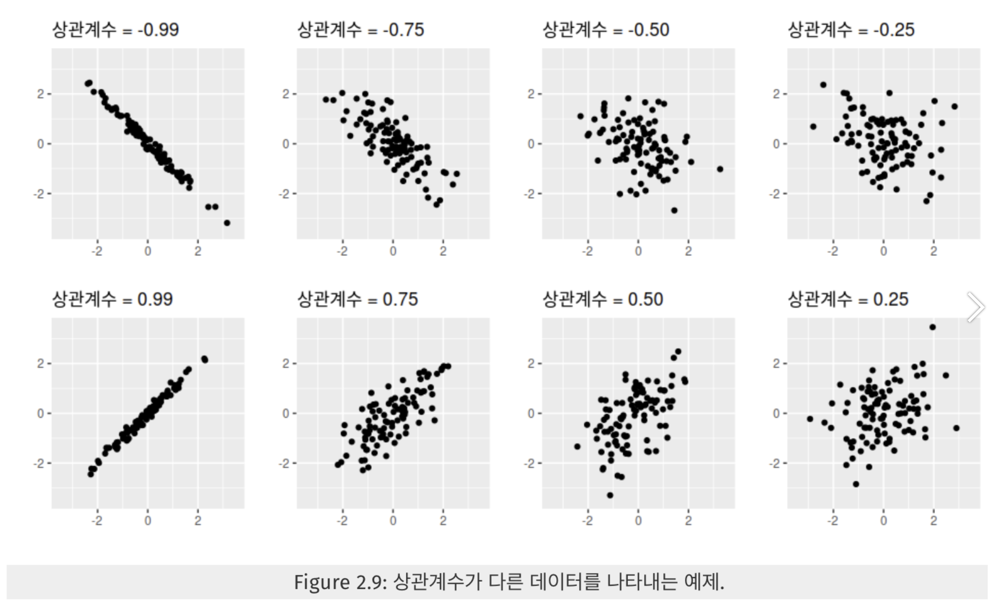
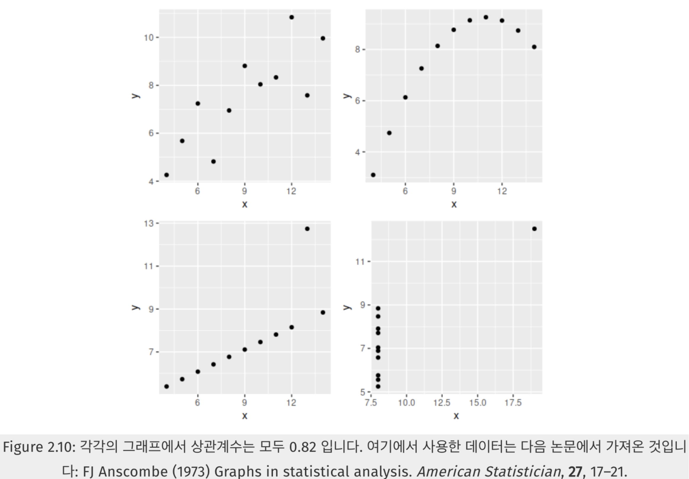
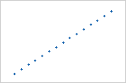
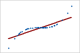

# 상관계수 (Correlation Coefficient)

## 상관계수

두 변수가 어떤 상관관계를 가지는지 측정하는 척도.

- +1 : 완벽한 양의 상관관계
- 0 : 상관관계 없음
- -1 : 완벽한 음의 상관관계

## Pearson Correlation Coefficient

두 변수 X와 Y간의 **선형 상관관계**를 측정하는 척도

)

$$
r_{xy} = \frac{\sum_i^n(X_i - \bar X)(Y_i - \bar Y)}{\sqrt{\sum_i^n(X_i-\bar X)^2}\sqrt{\sum_i^n(Y_i-\bar Y)^2}}
$$

즉, 위 식을 통해,

1. 각 vector의 표본평균($\bar X$, $\bar Y$)를 구해서  normalization을 하고
2. normalized vector 사이의 cosine similarity를 계산

피어슨 상관게수는 다양한 상황에 쓰이지만, normalized cosine similarity를 계산하는 것이기에 similarity로도 계산. 피어슨 상관계수를 similarity로 쓰이는 예로는 추천 시스템이 있다. (추천시스템에서 user-user or item-item 간 similarity를 계산할 때 사용.)

STS(Semantic Textual Similarity) task를 평가하기 위해 cosine similarity scores of sentences representation와 human-annotated gold scores 사이의 유사도를 계산하기 위해 사용될 수도 있다. (in [ConSERT paper](https://aclanthology.org/2021.acl-long.393.pdf))

**상관관계를 구할때 주의할점**

상관관계는 선형관계의 강도만 측정하기에, 같은 값을 가지더라도 관계는 아주 다를 수 있다. 따라서 상관계수 값에만 의존하지말고 그래프로 그려보아서 확인하는 것이 중요하다.

## Spearman Correlation Coefficient

두 변수 순위 사이의 단순 관계를 측정하는 척도

Pearson Correlation Coefficient은  두 계량형 변수 사이의 선형관계를 평가한다. 이때 한 변수의 변화가 다른 변수 변화에 비례적으로 연관되어 있을 경우 선형관계라고 한다.

반면 Spearman Correlation Coefficient은 두 계량형 또는 순서형 변수 사이의 단순 관계를 평가한다. 이때 단순 관계에서 두 변수는 함께 변화하는 경향은 있지만 반드시 일정한 비율로 변화하는 것은 아니다.  따라서 Spearman Correlation Coefficient은 원시 데이터가 아닌 각 변수에 대해 순서를 매긴 값을 기반으로 측정된다.

## Pearson 및 Spearman 계수 비교

Pearson 상관 계수가 +1이 되도록 하기 위해 한 변수가 증가하면 다른 변수가 일정한 양만큼 증가해야한다.. 이 관계는 완전한 선을 형성한다. 이 경우 Spearman 상관 계수 값은 +1.

한 변수가 증가하면 다른 변수가 증가하지만 양이 일정하지 않은 관계인 경우, Pearson 상관 계수는 양수이지만 +1보다 작게된다. 이와 달리 Spearman 계수는 여전히 +1이다.

## 참고 자료

- [https://umbum.dev/1006](https://umbum.dev/1006)
- [https://support.minitab.com/ko-kr/minitab/18/help-and-how-to/statistics/basic-statistics/how-to/correlation/interpret-the-results/key-results/](
