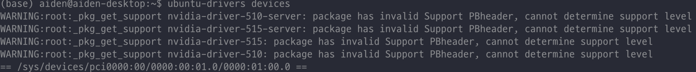
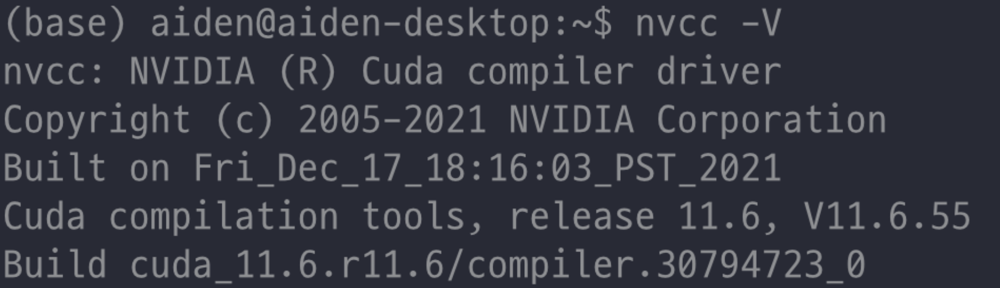
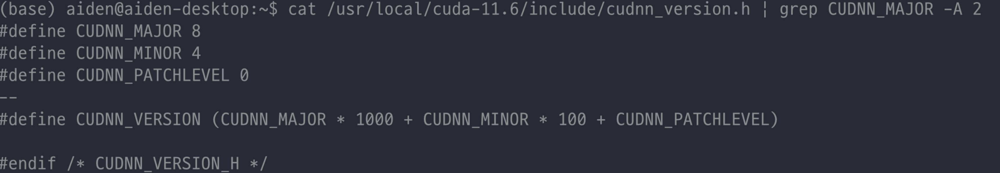

# GPU 관련 설치 : nvidia driver, CUDA,  CUDNN

## 우분투 nvidia driver 설치

1. ubuntu-drivers-cmmon 패키지를 설치하면 그래픽 카드 드라이버를 추천 해줌

   ```bash
   apt install -y ubuntu-drivers-common
   ```

2. `ubuntu-drivers devices` 명령어를 통해 어떤 드라이버를 설치하면 좋을지 확인가능

   

   

   ⇒ 결과 : 510, 515, 470(가장 추천)

3. 설치 : `sudo apt-get install nvidia-driver-[recommended 버전]`

   - 예 : `sudo apt install -y nvidia-dirver-460`

---

## CUDA 설치

1. 기존 cuda 제거 : `sudo rm -rf /usr/local/cuda*` 

2. 호환되는 버전의 cuda를 찾아둔다 

   - [GPU driver와 CUDA 버전 호환성 확인](https://docs.nvidia.com/cuda/cuda-toolkit-release-notes/index.html#cuda-major-component-versions__table-cuda-toolkit-driver-versions)

3. 해당 버전의 cuda 설치 → [해당 링크](https://developer.nvidia.com/cuda-toolkit-archive)

4. 설치 완료 후, library path 추가

   ```bash
   $ vim ~/.bashrc
   ```

   ```bash
   ## CUDA and cuDNN paths
   export PATH=/usr/local/cuda-[VERSION]/bin:${PATH} ## [VERSION]안에 설치한 버전 입력
   export LD_LIBRARY_PATH=/usr/local/cuda-[VERSION]/lib64:${LD_LIBRARY_PATH}
   ```

5. `nvcc -V` 명령어로 CUDA 설치 확인
   

---

## CUDNN 설치

1. CUDA 버전에 맞는 cuDNN 확인 → [해당 링크](https://hwk0702.github.io/python/tips/2021/04/23/NVIDEA/)

2. CUDA 버전, 자신의 환경에 맞는 파일 다운

3. 해당파일 압축 풀기 `tar -xzvf cudnn-x.x-linux-x64-v8.x.x.x.tgz`

4. include폴더안의 파일은 cuda의 include로 lib64폴더안의 파일은 cuda의 lib64로 복사

   ```bash
   cd cuda
   cp include/cudnn* /usr/local/cuda-[VERSION]/include
   cp lib64/libcudnn* /usr/local/cuda-[VERSION]/lib64/
   chmod a+r /usr/local/cuda-[VERSION]/lib64/libcudnn*
   ```

5. cudnn 설치 확인

   ```bash
   cat /usr/local/cuda-[VERSION]/include/cudnn_version.h | grep CUDNN_MAJOR -A 2
   ```

   


## pyTorch 설치

## PyTorch cuda 확인
```python
import torch
# torch.cuda.is_available()
device = torch.device("cuda:0" if torch.cuda.is_available() else "cpu")
X_train = torch.FloatTensor([0., 1., 2.])
X_train = X_train.cuda()
```

## 참고자료

- [https://hwk0702.github.io/python/tips/2021/04/23/NVIDEA/](https://hwk0702.github.io/python/tips/2021/04/23/NVIDEA/) (추천)
- [https://nirsa.tistory.com/332](https://nirsa.tistory.com/332)
- [https://robot9710.tistory.com/29](https://robot9710.tistory.com/29)
- [https://kyumdoctor.co.kr/30](
